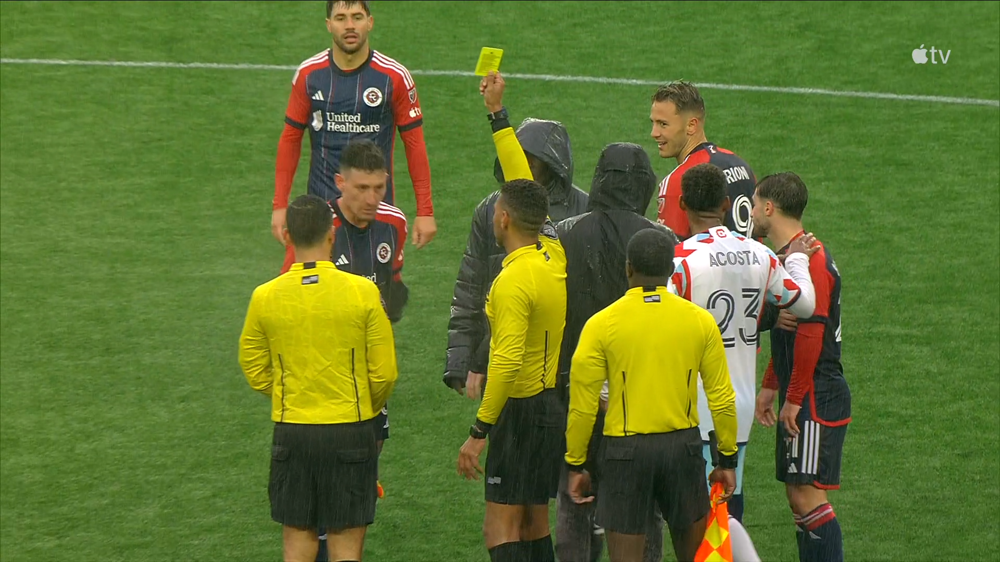
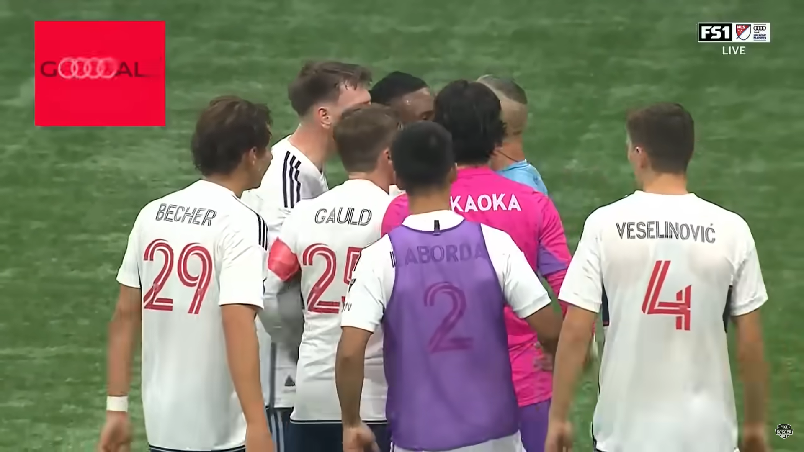
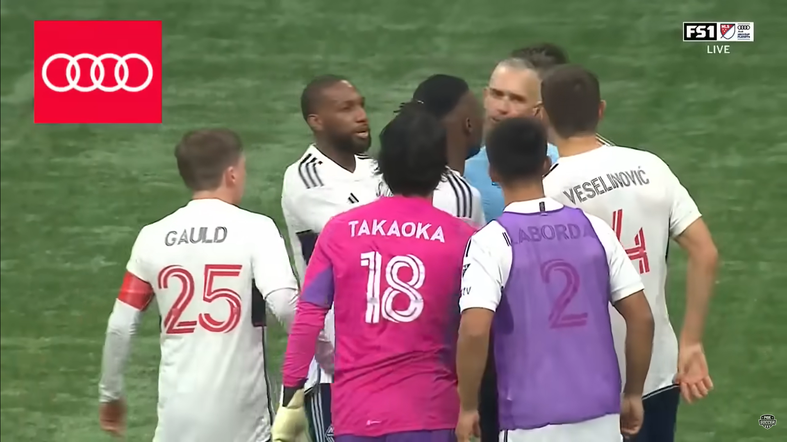

# Mobbing

## 3/23/2024 SJ 2 vs SEA 0 69:28 - 5 players from SJ (top left player was a peacemeker) - referee cautions one player

SEA player is pushed in the penalty area by a defender after heading the ball backwards and outside the penalty area to a team-mate. The referee immediatly calls a penalty kick.

While I agree that no penalty should of been called and that VAR should of intervened as this was a clear and obvious error, this behavior can't be accepted.

## 3/23/2024 COL 0 vs HOU 1 Full time - 3 players from COL - no sanction by referee
COL Number 5 is elbowed in the face by an opponent. He remains on the ground with one hand to his face and one hand in the air in the penalty area. The referee does not stop play and his team-mates continue playing as they have possession. The opposing team gains possession and scores from a counter attack. He has a visible mark on his face. 

I believe referee should have stopped play as this was a head injury. It is not clear if this is foul worthy (one angle only shown) but any complaints about stopping playing should have occured before COL loses possession of the ball or they should have kicked the ball out of play. 

## 3/23/2024 NE 1 vs CHI 1 Full time - 6+ people from NE - one player cautioned
There was no major match changing decision that was missed.

I only watched from the 70th minute upward. The referee failed to give a foul for NE near the assistant referee for a charge when the ball was not in playing distance and on the opposite touchline for a trip. That's it. The mobbing and agression had no basis unless I missed something - NE continues to be last in the standings.

## 3/16/2024 Montreal 3 vs Chicago 4 Full time - 4 players from Montreal (others are peacemakers) - no sanction from referee
After a thrilling come back win by Chicago with a 60+ yard wind assisted wonder goal, Montreal seems to believe that many decisions went against their team and contributed to their lose.

Montreal was one goal disallowed and called offside but was clearly onside (once you draw lines) but not overturned even after VAR review but this happened in the first half. There was a goalkeeper handball in the second half that was missed that was outside the penalty area that should of been a caution for SPA.

[Video from Reddit](https://www.reddit.com/r/MLS/comments/1bgieyv/montreal_players_confront_officials_after_final/)

## 2023-11-05 VAN-LA 0-2 Full time - 7 players from VAN - no sanction from referee
The referee runs into an attacker who had a clear shot on goal from outside the penalty area. The attacking team immediatly lose possession and their opponents score a goal. They then mob the referee. The goal was later reversed after VAR review due to offside.

Four of the players should of been sent-off for deliberately initiating contact on the referee or putting their hand in the referee's face. I don't care if this is a playoff game. There is literally no other major sport that tolerates this.

[Video on YouTube](https://www.youtube.com/watch?v=3HmBOeHGUeI)

## 2024-03-04 (Competition: La Liga) VAL-RMA 2-2 Full time - 6 players from VAL - one player sent-off
The referee blows the final whistle then the ball enters the goal.

The referee sends off a player for running in and yelling in his face. Someone needed to be sent-off - it didn't really matter who.

## 2023-11-04 RBNY-CIN 1-1 End of regular time / penalties upcoming - 6 players from RBNY - one player cautioned

After the goal-winning goal is disallowed after VAR review for handball and a foul and the referee signals the end of regular time, the referee is surrounded.

The final decision was correct and none of these actions are warranted. Even after multiple times of pointing to go away, the players refuse to stop condronting the referee.

