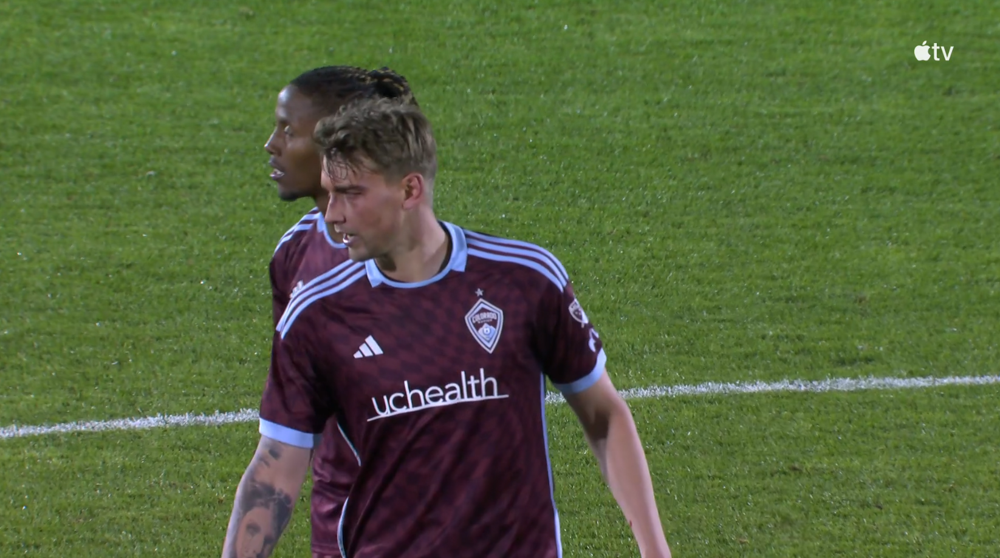

3/23/2024 SJ vs SEA 69:28 - 5 players from SJ (top left player was a peacemeker) - referee cautions one player
SEA player is pushed in the penalty area by a defender after heading the ball backwards and outside the penalty area to a team-mate. The referee immediatly calls a penalty kick.

While I agree that no penalty should of been called and that VAR should of intervened as this was a clear and obvious error, this behavior can't be accepted.

3/23/2024 COL vs HOU Full time - 3 players from COL - no sanction by referee
COL Number 5 is elbowed in the face by an opponent. He remains on the ground with one hand to his face and one hand in the air in the penalty area. The referee does not stop play and his team-mates continue playing as they have possession. The opposing team gains possession and scores from a counter attack. He has a visible mark on his face. 

I believe referee should have stopped play as this was a head injury. It is not clear if this is foul worthy (one angle only shown) but any complaints about stopping playing should have occured before COL loses possession of the ball or they should have kicked the ball out of play. 

3/16/2024 Montreal vs Chicago - 4 players from Montreal (others are peacemakers)